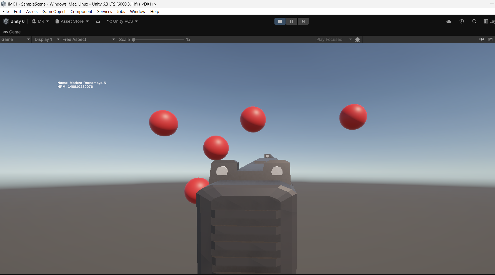

# Tugas Game FPS

Game ini merupakan tugas untuk mata kuliah **Interaksi Manusia dan Komputer (IMK)** yang mengusung genre *First-Person Shooter* (FPS) sederhana yang berfokus pada mekanisme menembak sasaran (*target shooting*) secara *real-time*.

## Fitur Utama

* **Mekanisme Menembak Raycast**: Sistem tembakan instan menggunakan teknik *Raycasting* yang akurat disertai visual efek *Laser Line*.
* **Sistem Respawn Target Acak**: Setiap kali target bola berhasil ditembak, target akan otomatis berteleportasi (*respawn*) ke koordinat acak di sekitar jangkauan pandang pemain secara terus-menerus.
* **Muzzle Flash Efek Beruntun**: Efek ledakan api pada moncong senjata (*muzzle flash*) yang responsif dan sinkron dengan *fire rate* senjata meskipun ditembakkan secara cepat.
* **Audio Feedback**: Respons suara tembakan yang sinkron di setiap klik.

---

## Tampilan Game

Berikut adalah dokumentasi tampilan antarmuka dan *gameplay* dari game ini:

---

## Spesifikasi Teknologi & Aset

* **Game Engine**: Unity 6
* **Render Pipeline**: Universal Render Pipeline (URP)
* **Bahasa Pemrograman**: C# Script
* **Aset Pihak Ketiga**: 
  * Model Senjata: Glock 18 3D Model
  * Efek Partikel: WarFX Particle Pack (`WFXMR_MF Spr RIFLE3`)
  * Sound Audio: -

---

## Struktur Repositori

* `/Assets` - Berisi seluruh skrip C#, material, tekstur, prefab senjata, dan scene utama game.
* `/Packages` - Konfigurasi package manager Unity.
* `/ProjectSettings` - Pengaturan proyek Unity (input manager, tag, layer, dan render pipeline).

---

## Cara Menjalankan Game (Build Version)

Jika ingin memainkan game ini secara langsung tanpa melalui Unity Editor:
1. Unduh folder hasil build proyek ini.
2. Pastikan file `.exe` dan folder `_Data` berada di dalam satu direktori yang sama.
3. Jalankan file `IMK1-main.exe`.
4. Gunakan **Klik Kiri** untuk menembak target bola merah yang muncul secara acak.